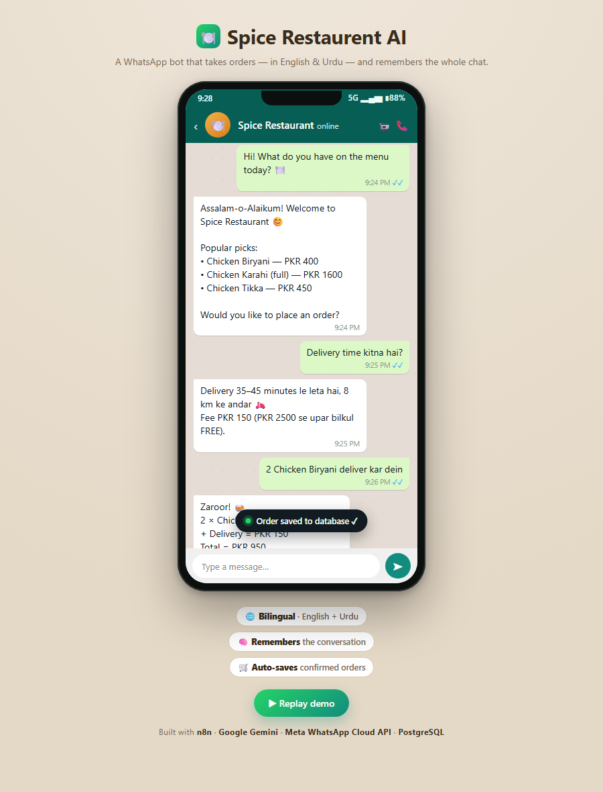

# 🍽️ Spice Restaurent AI — WhatsApp Restaurant Chatbot


> A **bilingual (English + Urdu)** AI WhatsApp assistant that chats with customers, shares the menu, remembers the conversation, and **saves confirmed orders to a database** — built with **n8n** + **Meta WhatsApp Cloud API** + **Google Gemini AI** + **PostgreSQL**.

Workflow name: **`Spice Restaurent AI`** (id `<YOUR_WORKFLOW_ID>`), running **active** in local n8n.
Restaurant brand used in replies: **Spice Restaurant**.

---

## 🎬 Demo

<p align="center">
  
</p>

<p align="center"><em>The bot takes an order in Roman Urdu, remembers the whole chat, and auto-saves the confirmed order to PostgreSQL.</em></p>

🔗 **Live animated demo:** open [`demo.html`](demo.html) in a browser (auto-plays the full conversation).
📄 **Deep dive:** [`node-report.html`](node-report.html) explains every node · [one-page cheat sheet PDF](Spice-Restaurent-AI-Cheat-Sheet.pdf).

---

## ✅ Status: fully live & tested

- 🌐 **Bilingual** — replies in English, Urdu script, or Roman Urdu, matching the customer.
- 🧠 **Conversation memory** — remembers earlier messages in each chat (pulled from `chat_logs`).
- 🛒 **Order saving** — when a customer confirms with "YES", the full order is written to the `orders` table.
- 🔑 **Permanent token** — a Meta **System User** token that never expires.
- 🔗 **Permanent public link** — ngrok reserved domain (never changes).
- 🗄️ **Every chat logged** to Postgres.

---

## Architecture

```
WhatsApp user ─► Meta Cloud API ─► ngrok (permanent HTTPS) ─► n8n webhook
                                                                  │
 GET  /webhook/whatsapp ─► Webhook Verify ─► Respond Challenge        (Meta verification)
 POST /webhook/whatsapp ─► Bot Brain ─► Parse Message ─► Load History ─► Build Request
                                                                  │
                          Gemini AI ─► Build Reply ─► Log to DB ─► Order Confirmed?
                                                                  ├─ YES ─► Save Order ─► Send WhatsApp
                                                                  └─ no  ───────────────► Send WhatsApp
```

**Nodes:**
1. **Webhook Verify (GET)** / **Respond Challenge** – Meta verification handshake.
2. **Webhook Messages (POST)** – receives incoming messages.
3. **Bot Brain** (Set node) – holds the editable system prompt (the bot's whole personality, menu & rules).
4. **Parse Message** – extracts sender + text; ignores status callbacks.
5. **Load History** – Postgres SELECT of the last 8 exchanges for this customer (memory).
6. **Build Request** – assembles the Gemini request with conversation history.
7. **Gemini AI** – `gemini-2.5-flash`, generates the reply.
8. **Build Reply** – cleans the reply and extracts the hidden `#ORDER#` line if present.
9. **Log to DB** – inserts the Q&A into `chat_logs`.
10. **Order Confirmed?** (IF) – routes to Save Order only when an order was confirmed.
11. **Save Order** – inserts the confirmed order into `orders`.
12. **Send WhatsApp** – sends the reply back via Cloud API.

---

## Infrastructure

| Component | Detail |
|---|---|
| n8n | container `n8n-container`, http://localhost:5678 |
| Postgres | container `resto-postgres`, db `restobot`, user `resto`, pass `<set in .env>`, host port `5433` |
| Network | `resto-net` (n8n reaches Postgres at host `resto-postgres:5432`) |
| n8n credential | "Resto Postgres" (id `<YOUR_PG_CREDENTIAL_ID>`) |
| Tables | `chat_logs`, `orders` |
| Public link | ngrok reserved domain `<your-domain>.ngrok-free.dev` |
| Phone Number ID | `<YOUR_PHONE_NUMBER_ID>` |
| WABA ID | `<YOUR_WABA_ID>` |
| Webhook verify token | `<YOUR_VERIFY_TOKEN>` |
| Gemini model | `gemini-2.5-flash` |

---

## 🟢 Keeping it running

The bot only works while two things are running on your PC:

1. **n8n + Postgres (Docker)** — already set to `restart: unless-stopped`.
2. **The ngrok tunnel** — run this in a terminal and keep it open (the URL never changes):
   ```
   ngrok http --url=<your-domain>.ngrok-free.dev 5678
   ```

The Meta webhook Callback URL is permanently:
```
https://<your-domain>.ngrok-free.dev/webhook/whatsapp
```

---

## ✏️ Editing the bot's brain (no code)

1. Open http://localhost:5678 → workflow **Spice Restaurent AI**.
2. Double-click the **Bot Brain** node.
3. Edit the **`systemPrompt`** text (menu, prices, rules, name, tone, deals — all here).
4. Click **Save**. Changes go live immediately.

The prompt is organised into `#` sections — add your line under the matching heading:
`# MENU`, `# DEALS`, `# STRICT RULES`, `# THINGS YOU CAN HELP WITH`, `# ABOUT SPICE RESTAURANT`.

---

## Adding more recipient numbers (test number)

The Meta **test number** can only message up to **5 pre-verified recipients**.
Meta → **WhatsApp → API Setup** → in the **To** field click **Manage phone number list** →
**Add phone number** → Meta sends a code to that WhatsApp number → enter the code to verify.

For **unlimited** recipients, register a **real business phone number** (Production setup) and
complete business verification.

---

## Permanent (System User) token

The bot uses a non-expiring **System User** token:
business.facebook.com → **Business Settings → System Users** → create Admin user →
assign the WhatsApp app (Full control) → **Generate token** → expiration **Never** →
permissions `whatsapp_business_messaging` + `whatsapp_business_management`.
Paste it as `Bearer <token>` in the **Send WhatsApp** node's `Authorization` header.

---

## ⚠️ Rotate leaked keys
Anything pasted in chat should be treated as compromised:
- **Gemini API key** – regenerate at https://aistudio.google.com/api-keys
- **n8n API key** – fine for local-only use, rotate if exposed.

---

## Database

```sql
-- chat_logs: every message + reply
-- orders:    confirmed orders (items JSONB, total_pkr, order_type, address, status)
```
Inspect:
```powershell
docker exec resto-postgres psql -U resto -d restobot -c "SELECT * FROM chat_logs ORDER BY id DESC LIMIT 5;"
docker exec resto-postgres psql -U resto -d restobot -c "SELECT * FROM orders ORDER BY id DESC LIMIT 5;"
```

## Files
- `Restaurent_Chatbot.workflow.json` — earlier workflow export.
- `schema.sql` — database tables.
- `docker-compose.yml` — reproducible n8n + Postgres stack.

## Notes / limits (WhatsApp test number)
- Can only message pre-verified recipient numbers (max 5).
- Free-form replies work inside the 24-hour customer-service window (opens when the user
  messages first — fine for this bot).
- For unlimited recipients, add a real phone number in Production setup.
